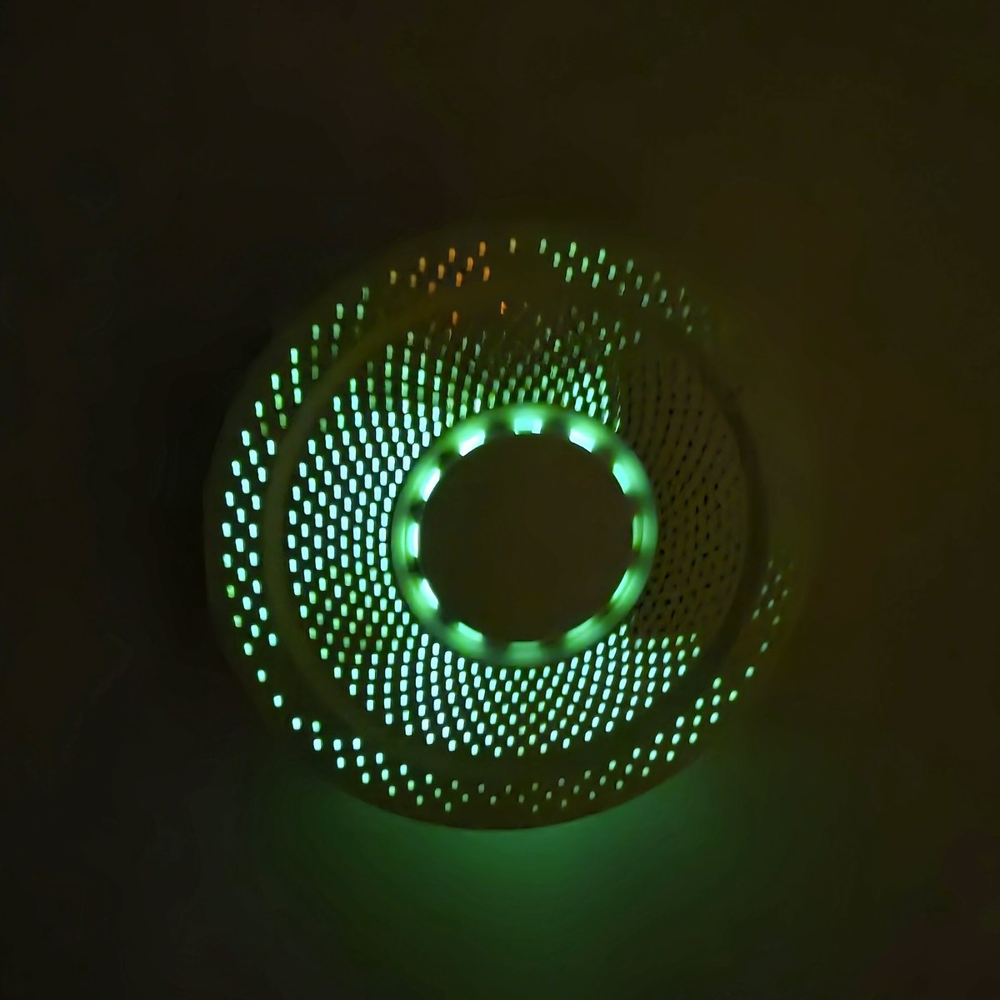
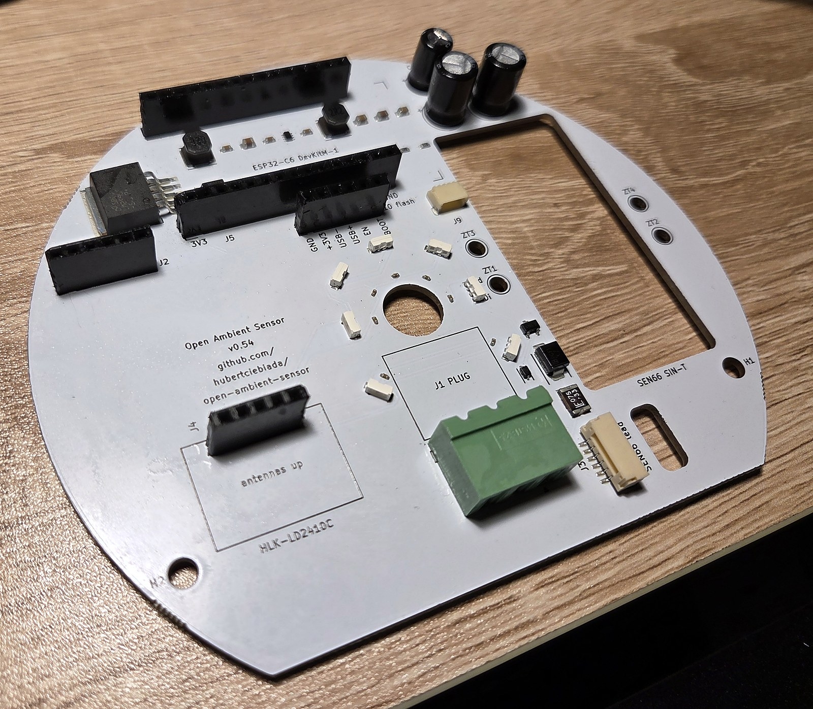

# OAS — Open Ambient Sensor

**DIY multi-sensor environmental monitor for indoor spaces.** Measures air quality and presence; mounts on a standard wall-recessed electrical box; runs ESPHome and integrates natively with Home Assistant.

[](./GPLv3-LICENSE.md)
[](#status)
[](https://github.com/hubertciebiada/open-ambient-sensor/releases/latest)
[](#hardware-overview)
[](https://esphome.io)

<p align="center">
  
  &nbsp;
  
</p>

---

## Status

**v0.54 — manufactured, bench-validated and in use.** Boards of this revision were fabricated and SMT-assembled at JLCPCB, brought up on the bench with a repeatable per-unit check, and run in a multi-unit deployment as the sensor input for Home Assistant HVAC automations. Working on the delivered hardware: the 24 V power chain, the Sensirion SEN66 (CO₂ / PM / VOC / NOx / T / RH, with Sensirion's STAR temperature compensation running inside the module), the HLK-LD2410C presence radar including stillness detection, the LED ring, Wi-Fi / OTA / native Home Assistant API, the Bluetooth proxy and the on-device web dashboard. The firmware reports `project_version: v0.54`, matching the version printed on the silkscreen. The design is fully script-generated and verified: `build.py` 35/35 stages PASS, DRC 0 violations / 0 unconnected, JLCPCB DFM 0 Danger on both the bare-board and assembly checks. The production files for this revision are attached to the [GitHub release](https://github.com/hubertciebiada/open-ambient-sensor/releases). See [`CLAUDE.md`](./CLAUDE.md) for the design rationale, hard constraints and the lessons learned along the way.

---

## Can I build one today?

**Yes — this revision has been built and works.** What to know before ordering:

- **The production files are in the repo.** [`hardware/output/jlcpcb/`](./hardware/output/jlcpcb/) holds the gerber + drill bundle, the BOM and the CPL files for JLCPCB SMT assembly (also attached to the GitHub release); they are regenerated and verified by the 35-stage pipeline on every build. Follow the ordering workflow in [`CLAUDE.md`](./CLAUDE.md#jlcpcb-ordering-workflow-distilled-from-v040-saga) — in particular the pre-payment Assembly Order cross-check, which has caught wrong-part substitutions more than once.
- **Seven components are hand-soldered after assembly** — the 24 V terminal block, the two ESP32-C6-DevKitM-1 socket headers, the LD2410C header and the three THT capacitors — and the SEN66 is attached with its JST GH lead and zip ties. Flashing and Home Assistant onboarding are documented in [`firmware/README.md`](./firmware/README.md).
- **Cost positioning.** OAS deliberately sits above bargain-DIY BOM cost: a calibrated Sensirion SEN66 combo sensor, an mmWave radar with stillness detection, and a commercial-grade injection-moulded enclosure are all premium choices made on purpose — see [Design philosophy](#design-philosophy). If lowest possible cost is your priority, other open-source projects optimise for that instead.

**Known limitations** (findings on the built units):

- **The LED ring effect is weaker than designed.** For the SEN66 to read correctly inside the enclosure, an air duct has to guide room air from the perforated cover to the sensor inlet, and that duct sits in front of part of the ring. The duct is not part of this repository yet.
- **Detecting a sleeping person relies on the presence timeout**, not on the radar's still-target thresholds — see the notes in [`firmware/esphome/packages/presence.yaml`](./firmware/esphome/packages/presence.yaml).
- **v0.51 prototype boards** need the pin overrides in [`firmware/esphome/HARDWARE-COMPAT-v0.51.md`](./firmware/esphome/HARDWARE-COMPAT-v0.51.md); v0.54 boards run the firmware defaults.

A consolidated step-by-step build guide is not written yet; open work is tracked in the [TODO list](./CLAUDE.md#open-work--todo) in `CLAUDE.md`.

---

## What it measures

- **Air quality** — CO₂, PM1 / PM2.5 / PM4 / PM10, VOC index, NOx index, temperature, relative humidity (Sensirion SEN66)
- **Occupancy / presence** — mmWave radar with stillness detection (HiLink HLK-LD2410C)

## Additional features

- 7× SK6812-SIDE RGB AQI ring with breathing effect (7 LEDs on an 8-slot ring; D13 vacated for the J1 24 V terminal); colour reflects an aggregated air-quality index
- **Bluetooth proxy** — extends BLE range across the deployment for Home Assistant BLE integrations
- Qwiic / STEMMA QT expansion port — future sensors without a PCB respin

---

## Design philosophy

The open-source DIY space offers many indoor-air-quality projects. Most optimise aggressively for cost. **OAS holds two priorities non-negotiable**, even when the trade-off is a higher per-unit BOM than the cheapest alternatives:

1. **Measurement quality.** Sensor choices favour accuracy and long-term stability over price.
2. **Aesthetic acceptability.** The device is meant to live in inhabited rooms; a commercial-grade injection-moulded enclosure replaces the typical 3D-printed box.

Both compromises (cheap-but-inaccurate, accurate-but-ugly) are rejected. See [`CLAUDE.md`](./CLAUDE.md) for the full rationale and the hard constraints any change must clear.

---

## Hardware overview

| Function | Component | Interface |
|---|---|---|
| MCU | ESP32-C6-DevKitM-1-N4 (EAN 5904422385651) | 2× USB-C on module |
| Air quality combo | Sensirion SEN66-SIN-T | I²C (JST GH 6-pin cable) |
| Presence | HiLink HLK-LD2410C | UART @ 256000 baud |
| Visual indicator | 7× SK6812-SIDE side-emit ring (Ø26 mm base pitch, 8 slots with D13 vacated for J1) | 1-wire WS281x on GPIO 8 |
| Power input | 24 V DC terminal block + TVS + PTC + reverse-polarity P-FET | — |

**Enclosure:** SZOMK AK-N-94 (Ø128 mm perforated white ABS). PCB is a **Ø120 mm D-shape** with a flat chord along the bottom edge. Mounts on a standard wall-recessed electrical box (60 mm screw pitch).

Authoritative module metadata (EAN, MPN, datasheet URLs, derived dimensions) lives in [`hardware/kicad/boardgen/_project.py::EXTERNAL_MODULES`](./hardware/kicad/boardgen/_project.py). Pinout is in [`boardgen/_project.py::GPIO_ASSIGNMENTS`](./hardware/kicad/boardgen/_project.py). Full design rationale and hard constraints: [`CLAUDE.md`](./CLAUDE.md).

---

## Repository layout

```
open-ambient-sensor/
├── README.md                       # this file
├── CLAUDE.md                       # design rationale, hard constraints, working conventions
├── GPLv3-LICENSE.md
├── .gitignore
├── firmware/
│   ├── README.md                   # flashing + Home Assistant integration
│   ├── esphome/
│   │   ├── oas.yaml                # top-level ESPHome config
│   │   ├── packages/               # core / leds / air-quality / presence / bt-proxy
│   │   └── examples/               # anonymized per-device override examples
│   ├── tools/                      # bringup_check.py — repeatable per-unit bench check
│   └── secrets.yaml.example
└── hardware/
    ├── kicad/
    │   ├── build.py                # THE single entrypoint — emits sources + runs the 35-stage pipeline
    │   ├── boardgen/               # source of truth — generators for every .kicad_* file
    │   ├── pipeline/               # 35 verification/export stages (generic / oas / jlcpcb)
    │   ├── tests/                  # unit-test suite (pytest; run by stage 16 of build.py)
    │   ├── tools/                  # manual-trigger scripts (route extract, DFM upload, jlcparts cache)
    │   ├── oas_routes.py           # routing snapshot (replayed onto the generated PCB)
    │   ├── lcsc_mapping.py         # SMD BOM — LCSC SKU source of truth
    │   └── oas.kicad_*             # generated KiCad project files (derived artefacts — never hand-edit)
    ├── renders/                    # generated previews (PNG + SVG, visual changelog)
    ├── photos/                     # photos of built units (EXIF stripped)
    └── output/                     # production deliverables (ibom + jlcpcb/ ZIP + BOM + 2× CPL)
```

---

## Rebuilding the design from source

The KiCad project is **fully script-generated**. The `.kicad_pcb` / `.kicad_sch` / `.kicad_pro` / library files are derived artefacts — **never hand-edit them**; the next build overwrites every edit. The source of truth lives in [`hardware/kicad/boardgen/`](./hardware/kicad/boardgen/) (Python generators), [`lcsc_mapping.py`](./hardware/kicad/lcsc_mapping.py) (SMD BOM), and [`oas_routes.py`](./hardware/kicad/oas_routes.py) (routing snapshot).

```sh
cd hardware/kicad
python build.py
```

`build.py` is the only top-level entrypoint. It regenerates every KiCad source file bit-identically (deterministic v5 UUIDs — an unchanged tree produces an empty `git diff`) and then runs the full 35-stage verification pipeline: DRC, ERC, determinism self-check, analytical DC / ampacity / boot-strap / thermal / I²C-rise-time checks, ngspice SPICE simulations (buck soft-start, IEC 61000-4-5 surge, reverse polarity), unit tests, renders, and the vendor export stages that produce the JLCPCB deliverables. Any stage failure aborts the build.

**Requirements:**

- Python 3.11+
- KiCad 10 with `kicad-cli` on `PATH`
- `pip install mypy pytest cairosvg pygerber`
- `git submodule update --init` (kicad-skip, InteractiveHtmlBom, jlcparts, and other tools under `hardware/kicad/third_party/`)
- One-time jlcparts offline cache for the LCSC part-verification stage: `python hardware/kicad/tools/setup_jlcparts_cache.py` (~2 GiB download, expands to a local SQLite cache)

ngspice and the vendor SPICE models are downloaded automatically into a gitignored `.tmp/` directory on first run. Individual pipeline stages are independently runnable for debugging (e.g. `python pipeline/generic/03_drc.py`), but a committable state always comes from a full `build.py` pass.

---

## Contributing

Contributions are welcome once the design stabilises. Any change must clear both design pillars (measurement quality, aesthetic acceptability) and the hard constraints listed in [`CLAUDE.md`](./CLAUDE.md#hard-constraints-do-not-violate-without-an-explicit-documented-decision).

**This is a public repository** — see the [public-repository rules](./CLAUDE.md#-public-repository-rules) for the anonymisation and third-party-IP requirements that apply to every committed file.

---

## License

GNU General Public License v3.0 — see [`GPLv3-LICENSE.md`](./GPLv3-LICENSE.md).

---

## References

- AirGradient ONE (open-source inspiration): <https://github.com/airgradienthq/arduino>
- Sensirion SEN66 product page: <https://sensirion.com/products/catalog/SEN66>
- HiLink LD2410 documentation: <https://www.hlktech.net>
- ESPHome documentation: <https://esphome.io>
- JLCPCB component library: <https://jlcpcb.com/parts>
